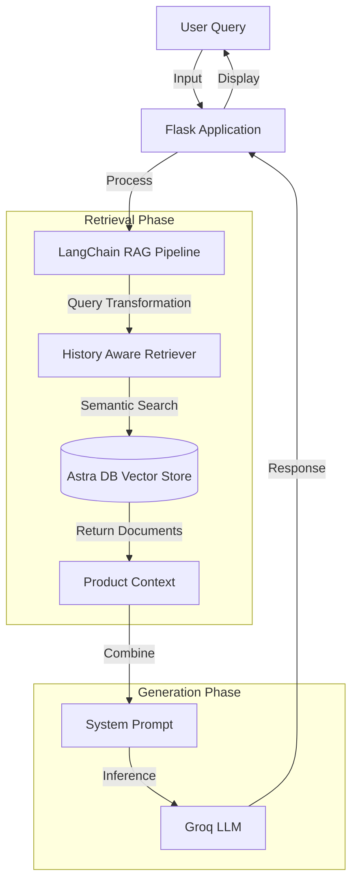

# 🛒 Flipkart Product Recommender RAG


## 📖 About The Project

The **Flipkart Product Recommender** is an intelligent e-commerce assistant designed to help users discover products based on natural language queries. Unlike traditional keyword search, this system utilizes **Retrieval-Augmented Generation (RAG)** to understand user intent and context.

By leveraging **Groq's high-speed inference engine** and **DataStax Astra DB** for vector storage, the bot analyzes product titles and reviews to provide accurate, context-aware recommendations and answer specific questions about product features.

## ✨ Key Features

*   **Conversational AI:** Maintains chat history for context-aware interactions.
*   **RAG Architecture:** Retrieves real-time product data to ground LLM responses, reducing hallucinations.
*   **High-Performance Inference:** Powered by Groq LPU for near-instant responses.
*   **Vector Search:** Uses semantic search via Astra DB to find relevant products even without exact keyword matches.
*   **Interactive UI:** A clean, responsive chat interface styled with modern CSS.

---

## 🛠️ Tech Stack

### Core AI & Logic
*   **LangChain:** Framework for building the RAG pipeline and managing chat history.
*   **Groq API:** Provides the LLM (e.g., Llama 3 or Mixtral) for generation.
*   **Hugging Face:** Used for generating text embeddings.

### Database & Storage
*   **DataStax Astra DB:** Serverless Cassandra database used as a Vector Store.

### Backend & Frontend
*   **Python (Flask):** Web server handling API requests.
*   **HTML/CSS:** Custom-styled chat interface.

### DevOps & Monitoring (Optional/Extended)
*   **Docker & Kubernetes:** Containerization and orchestration.
*   **Prometheus & Grafana:** Metrics and monitoring.

---

## 🏗️ Architecture

The system follows a standard RAG pipeline architecture:



## 🔄 Project Workflow

1.  **Data Ingestion:** Flipkart product data (titles, reviews, specs) is processed and converted into vector embeddings using Hugging Face models.
2.  **Vector Storage:** These embeddings are stored in Astra DB.
3.  **User Interaction:**
    *   The user asks a question (e.g., "Suggest a good gaming laptop under 60k").
    *   The system reformulates the question based on previous chat history to ensure context is preserved.
4.  **Retrieval:** The reformulated query is used to search Astra DB for the most relevant product documents.
5.  **Generation:** The retrieved documents + the user's query are sent to the Groq LLM.
6.  **Response:** The LLM generates a helpful, natural language response recommending specific products.

---

## 🚀 Getting Started

### Prerequisites

*   Python 3.9+
*   An Astra DB Account (for the vector database)
*   A Groq API Key
*   A Hugging Face Token

### Installation

1.  **Clone the repository**
    ```bash
    git clone https://github.com/yourusername/flipkart-product-recommender.git
    cd flipkart-product-recommender
    ```

2.  **Install dependencies**
    ```bash
    pip install -r requirements.txt
    ```

3.  **Configure Environment Variables**
    Create a `.env` file in the root directory and add your credentials:
    ```env
    GROQ_API_KEY="your_groq_api_key"
    HF_TOKEN="your_huggingface_token"
    ASTRA_DB_API_ENDPOINT="your_astra_db_endpoint"
    ASTRA_DB_APPLICATION_TOKEN="your_astra_db_token"
    ASTRA_DB_KEYSPACE="default_keyspace"
    ```

4.  **Run the Application**
    ```bash
    python app.py
    ```

5.  **Access the Chatbot**
    Open your browser and navigate to `http://localhost:5000`.

---

## 📂 Project Structure

```text
├── flipkart/
│   ├── config.py          # Configuration settings
│   ├── data_ingestion.py  # Scripts to load data into Astra DB
│   └── rag_chain.py       # RAG pipeline logic
├── static/
│   └── style.css          # Frontend styling
├── templates/
│   └── index.html         # Chat interface
├── app.py                 # Main Flask application
├── requirements.txt       # Python dependencies
└── README.md              # Project documentation
```